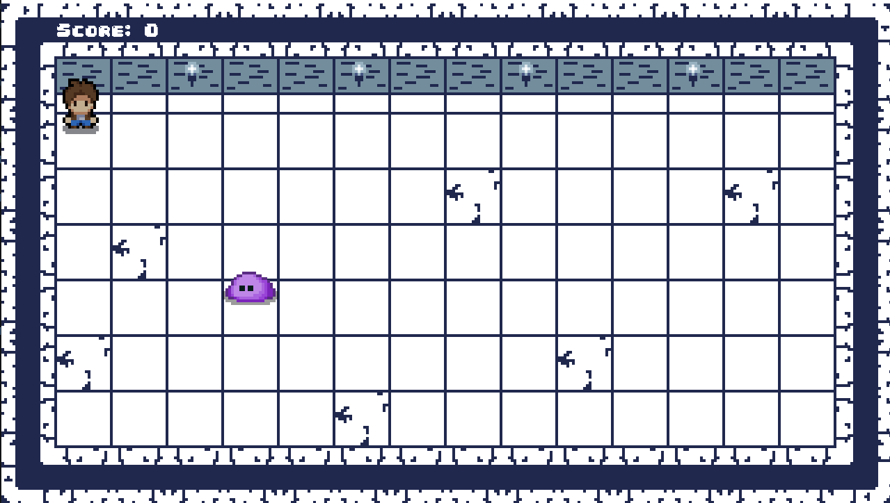
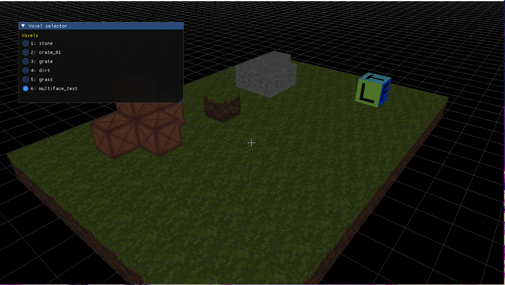

# KekLib2D

A lightweight and simple library for making 2D (And 3D) games with MonoGame.

This project is for learning and experimenting with MonoGame basics. It includes small games and code samples to help you get started with 2D game development in C#.

Since, KeKLib2D has "2D" in its name, it might be misleading, but the library always expands, and now it also includes some 3D functionality, including a voxel engine (KekLib3D.Voxels) and a simple 3D renderer (KekLib3D).

## Getting Started

1. Clone the repository.
2. Open the solution in Visual Studio or your preferred IDE.
3. Build and run the sample games.

## SlimeKiller
Basic project, which mostly resembles original [Monogame 2D Tutorial series](https://docs.monogame.net/articles/tutorials/building_2d_games/)



To run the SlimeKiller game, use the following command:
```bash
  dotnet run --project src/Games/SlimeKiller/SlimeKiller.csproj
```

## Sandbox
Work-In-Progress 3D voxel level editor, powered by KekLib3D and KekLib3D.Voxels libraries. It's main goal to be able to create and edit voxel worlds, using familiar Minecraft-ish building logic.


To run the Sandbox game, use the following command:
```bash
  dotnet run --project src/Games/Sandbox/Sandbox.csproj
```

## Update submodules
```bash
git submodule update --remote --force
```
